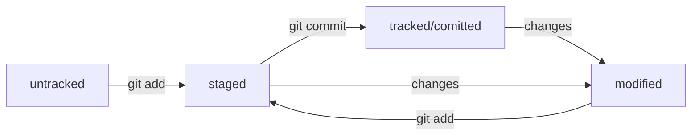

# Шпаргалка по Git и GitHub для начинающих

## Создаем git репозиторий
Для того, чтобы Git начал отслеживание изменений в проекте, нужно переместиться в папку проекта и ввести команду git init.

Пример:  
```
cd my_project
git init
```

«Разгитить» папку, если что-то пошло не так, — rm -rf .git
Проверить, что все получилось нужно командой git status
Команда git status выведет:
  * название текущей ветки: On branch master или On branch main;
  * сообщение о том, что в репозитории ещё нет коммитов: No commits yet;
  * сообщение, которое говорит: «чтобы что-нибудь закоммитить (то есть зафиксировать), нужно сначала это создать» — nothing to commit (create/copy files and use "git add" to track).

## Добавляем файл в репозиторитй и коммитим его
Познакомимся с командами git add и git commit.
Команда git add не сохраняет содержимое файлов в репозитории. Она сообщает Git, какие именно файлы нужно сохранить и какую их версию. Само сохранение, или фиксацию состояния файлов, называют коммитом (от англ. commit — «совершать», «фиксировать»). «Сделать коммит» значит сохранить текущую версию файла. 

Пример:

```
cd my_project
touch README.md #создали файл
git add --all #подготовит к сохранению все файлы
git commit -m 'создали файл readme' #сделает схранение, а ключ -m позволит присвоить коммиту сообщение
```

Чтобы посмотреть коммиты используем команду git log. Выводит она их в обратном порядке.

## Знакомимся с GitHub. Связываем локальный репозиторий с удаленным.
GitHub — платформа, которая работает с Git и упрощает командное взаимодействие.
Регистрируемся на GitHub, создаем реппозиторий, называем его также как проект в локальном реппозитории.
Осталось связать удалённый репозиторий с локальным, который уже есть на вашем компьютере. GitHub предоставляет для этого инструкцию (пункт …or push an existing repository from the command line).
Но перед этим нужно создать SSH ключи. 
Когда компьютеры обмениваются данными в сети, они следуют сетевым протоколам (англ. network protocols) — правилам обмена данными между компьютерами.
Один из наиболее распространённых сетевых протоколов — SSH (от англ. Secure Shell Protocol). Он обеспечивает безопасный обмен данными в сети. С помощью этого протокола можно получать данные с удалённого компьютера или отправлять их на него. Трафик шифруется, поэтому протокол безопасен.

SSH использует пару ключей для обеспечения безопасности — публичный и приватный: 
  * Приватный ключ (англ. private key) хранится только на вашем компьютере и не должен передаваться кому-либо ещё. Он используется для расшифровки данных.
  * Публичный ключ (англ. public key) доступен всем и используется для шифрования данных. Они могут быть расшифрованы парным приватным ключом.
Только вы можете расшифровать данные с помощью приватного ключа, но любой владелец публичного ключа может их для вас зашифровать. Эти два ключа связаны и образуют SSH-пару. В будущем вы наверняка будете использовать их для взаимодействия с GitHub и другими удалёнными серверами.

### Инструкция по генерации SSH-ключа
Для генерации SSH-пары можно использовать программу ssh-keygen. Откройте терминал и введите следующую команду.

```
ssh-keygen -t ed25519 -C "электронная почта, к которой привязан ваш аккаунт на GitHub" 
```

Теперь осталось проверить, что ключи действительно сгенерировались. Для этого вызовите эту команду.

```
ls -a ~/.ssh 
```

На экране должны появиться два файла — один с расширением .pub, другой — без. Файл в .pub — публичный, им можно делиться с веб-сайтами или коллегами. Файл без расширения .pub — приватный. Ни в коем случае не передавайте его никому! 

### Инструкция по связыванию SSH-ключа и GitHub-аккаунта
1. Скопируйте содержимое файла с публичным ключом в буфер обмена.

```
$ pbcopy < ~/.ssh/id_rsa.pub # скопировать содержимое ключа в буфер обмена
```

2. Перейдите на GitHub и выберите пункт Settings (англ. «настройки») в меню аккаунта.
3. В меню слева нажмите на пункт SSH and GPG keys.
4. В открывшейся вкладке выберите New SSH key (англ. «новый SSH-ключ»).
5. В поле Title (англ. «заголовок») напишите название ключа. Например, Personal key (англ. «личный ключ»).
6. В поле Key type (англ. «тип ключа») должно быть Authentication Key (англ. «ключ аутентификации»).
7. В поле Key скопируйте ваш ключ из буфера обмена.
8. Нажмите на кнопку Add SSH key (англ. «добавить SSH-ключ»).
9. Проверьте правильность ключа с помощью следующей команды.

```
ssh -T git@github.com 
```

### Наконец связывем удаленный репозиторий и локальный
Перейдите на страницу удалённого репозитория, выберите тип SSH и скопируйте URL. Кнопка справа позволит сделать это мгновенно.
Откройте консоль, перейдите в каталог локального репозитория и введите команду git remote add (от англ. remote — «удалённый» и add — «добавить»).

```
cd my_project
git remote add origin git@github.com:%ИМЯ_АККАУНТА%/my_project.git
```

Команде необходимо передать два параметра: имя удалённого репозитория и его URL. В качестве имени используйте слово origin. А URL вы скопировали со страницы удалённого репозитория.
origin (англ. «источник») — стандартный псевдоним, с помощью которого можно обращаться к главному удалённому репозиторию (обычно такой репозиторий один). Это значительно упрощает работу.

Убедиться, что репозитории связаны, — git remote -v

## Загружаем содержимое локального реппозитория на GitHub
За это отвечает команда git push (от англ. push — «толкать»).
В первый раз эту команду нужно вызвать с флагом -u и параметрами origin (имя удалённого репозитория) и main или master (название текущей ветки). Флаг -u свяжет локальную ветку с одноимённой удалённой. Как вы связывали локальный и удалённый репозитории в предыдущем уроке, так же и здесь нужно дополнительно связать ветки.
В дальнейшем при работе с удалённым репозиторием флаг -u можно опустить и писать просто git push.

## Что такое хеш. Хеширование коммитов
Информация о коммите — это набор данных: когда был сделан коммит, содержимое файлов в репозитории на момент коммита и ссылка на предыдущий, или родительский (англ. parent), коммит.
Git хеширует (преобразует) информацию о коммите с помощью алгоритма SHA-1 (от англ. Secure Hash Algorithm — «безопасный алгоритм хеширования») и получает для каждого коммита свой уникальный хеш — результат хеширования.
Обычно хеш — это короткая (40 символов в случае SHA-1) строка, которая состоит из цифр 0—9 и латинских букв A—F (неважно, заглавных или строчных). Она обладает следующими важными свойствами:
  * если хеш получить дважды для одного и того же набора входных данных, то результат будет гарантированно одинаковый;
  * если хоть что-то в исходных данных поменяется (хотя бы один символ), то хеш тоже изменится (причём сильно).

Git хранит таблицу соответствий хеш → информация о коммите. Если вы знаете хеш, вы можете узнать всё остальное: автора и дату коммита и содержимое закоммиченных файлов. Можно сказать, что хеш — основной идентификатор коммита.
При работе с Git хеши будут встречаться вам регулярно. Их можно будет передавать в качестве параметра разным Git-командам, чтобы указать, с каким коммитом нужно произвести то или иное действие.
Все хеши и таблицу хеш → информация о коммите Git сохраняет в служебные файлы. Они находятся в скрытой папке .git в репозитории проекта.

Сокращённый хеш (то есть первые несколько символов полного) можно использовать точно так же, как и полный. Для этого команда git log --oneline автоматически подбирает такую длину сокращённых хешей, чтобы они были уникальными в пределах репозитория и Git всегда мог понять, о каком коммите идёт речь.

## HEAD — всему голова

Файл HEAD (англ. «голова», «головной») — один из служебных файлов папки .git. Он указывает на коммит, который сделан последним (то есть на самый новый).
В этом можно убедиться с помощью терминала. Перейдите в папку .git командой cd. Посмотрите содержимое файла HEAD командой cat.
Внутри HEAD — ссылка на служебный файл: refs/heads/master (или refs/heads/main в зависимости от названия ветки). Если заглянуть в этот файл, можно увидеть хеш последнего коммита.

Когда вы делаете коммит, Git обновляет refs/heads/master — записывает в него хеш последнего коммита. Получается, что HEAD тоже обновляется, так как ссылается на refs/heads/master.
При работе с Git указатель HEAD используется довольно часто. Мы уже упоминали, что многие команды Git принимают в качестве параметра хеш коммита. Если нужно передать последний коммит, то вместо его хеша можно просто написать слово HEAD — Git поймёт, что вы имели в виду последний коммит.

## Статусы untracked/tracked, staged и modified

Одна из ключевых задач Git — отслеживать изменения файлов в репозитории. Для этого каждый файл помечается каким-либо статусом. Рассмотрим основные.
  * untracked (англ. «неотслеживаемый»)	  Мы говорили, что новые файлы в Git-репозитории помечаются как untracked, то есть неотслеживаемые. Git «видит», что такой файл существует, но не следит за изменениями в нём. У untracked-файла нет предыдущих версий, зафиксированных в коммитах или через команду git add.
  * staged (англ. «подготовленный»)  После выполнения команды git add файл попадает в staging area (от англ. stage — «сцена», «этап» и area — «область»), то есть в список файлов, которые войдут в коммит. В этот момент файл находится в состоянии staged.
  * tracked (англ. «отслеживаемый»). Состояние tracked — это противоположность untracked. Оно довольно широкое по смыслу: в него попадают файлы, которые уже были зафиксированы с помощью git commit, а также файлы, которые были добавлены в staging area командой git add. То есть все файлы, в которых Git так или иначе отслеживает изменения.
  * modified (англ. «изменённый»). Состояние modified означает, что Git сравнил содержимое файла с последней сохранённой версией и нашёл отличия. Например, файл был закоммичен и после этого изменён.

### Про staged и modified

Команда git add добавляет в staging area только текущее содержимое файла. Если вы, например, сделаете git add file.txt, а затем измените file.txt, то новое содержимое файла не будет находиться в staging.
Git сообщит об этом с помощью статуса modified: файл изменён относительно той версии, которая уже в staging. Чтобы добавить в staging последнюю версию, нужно выполнить git add file.txt ещё раз.


### Какие состояния показывает git status

Большинство файлов в типичном проекте будут находиться в состоянии tracked (то есть закоммичены и не изменены после коммита). Вы не увидите это состояние в выводе команды git status — иначе она бы каждый раз выводила список вообще всех файлов проекта.
В итоге git status показывает только следующие состояния файлов:
  * staged (Changes to be committed в выводе git status);
  * modified (Changes not staged for commit);
  * untracked (Untracked files).
